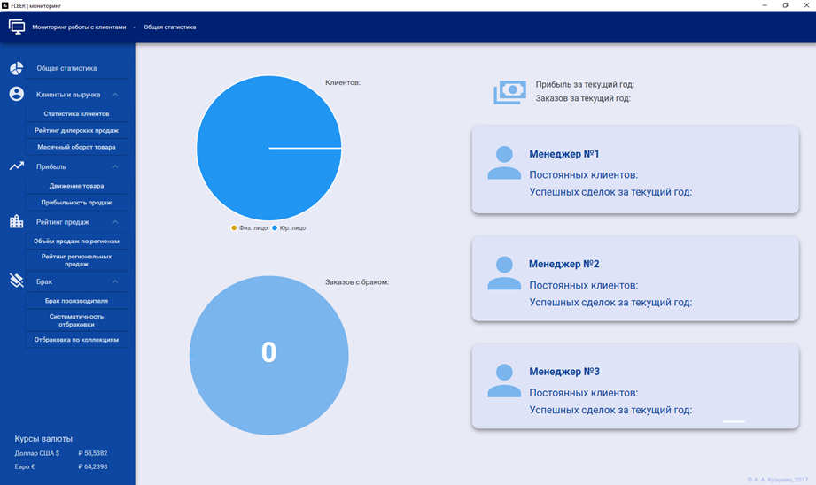
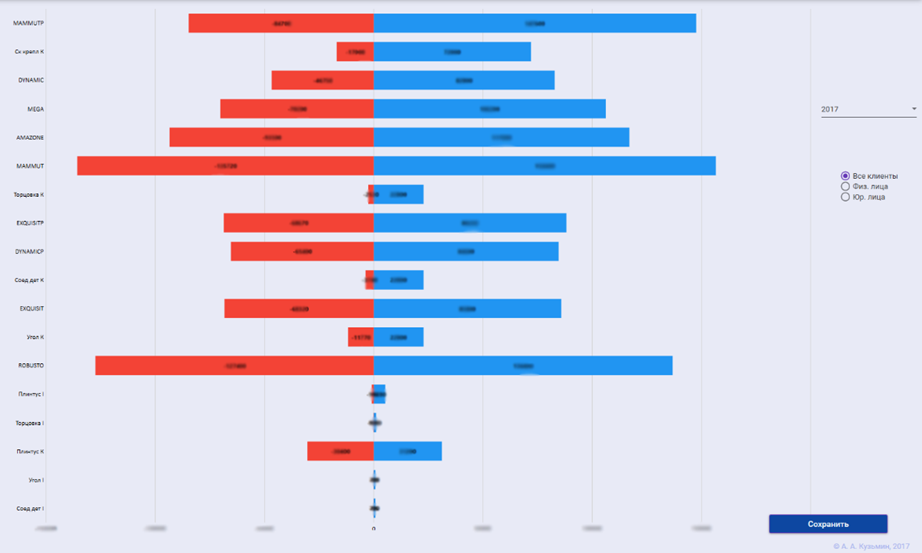

# Проект: "Автоматизированная система мониторинга работы с клиентами компании"

# Описание автоматизированной системы мониторинга:

Разработанная автоматизированная система мониторинга предназначена для директора по продажам. Она представлена в виде программного продукта с пользовательским интерфейсом. Процедура производит мониторинг данных компании и представляет результат в виде диаграмм:
1.	Статистика клиентов.
2.	Рейтинг дилерских продаж.
3.	Месячный оборот товара.
4.	Движение товара.
5.	Прибыльность продаж.
6.	Объём продаж по регионам.
7.	Рейтинг региональных продаж.
8.	Брак производителя.
9.	Систематичность отбраковки.
10.	 Отбраковка по коллекциям.

Для работы в данной системе пользователю необходимо пройти авторизацию в окне входа.
Главное окно системы мониторинга отображает статистику клиентов компании на круговой диаграмме, показывающей соотношение физических и юридических лиц, и отображает на второй диаграмме процент отбракованных заказов в текущем году. Также на главном экране выводится информация о прибыли за текущий год и статистика менеджеров по постоянным клиентам и успешным сделкам за текущий год.
Директор по продажам имеет возможность сформировать отчеты всех проведенных процедур, нажав на кнопку «сохранить». Отчет представляет собой файл формата xls. В данном файле составлена таблица проанализированной выборки и её графическое представление в виде диаграммы.

Проект является конфиденциальным, разработанным для существующей организации. В данном репозитории представлено описание и небольшая часть кода.
